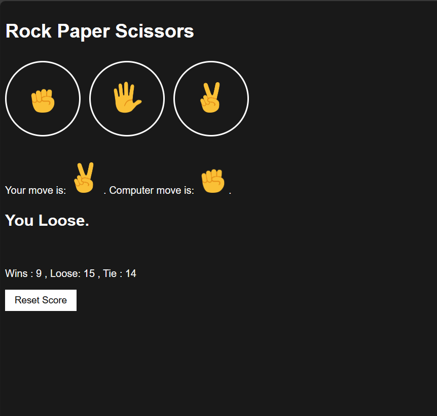
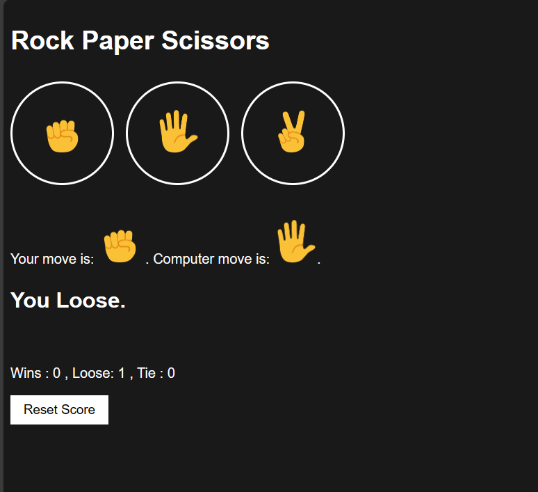

# ROCK-PAPER-SCISSORS

## Description
Here's a web-based version of the classic Rock, Paper, Scissors game using HTML, CSS, and JavaScript.
It's a fun project for users to play against the computer, with a user-friendly design that works on different devices.
It's perfect for honing decision-making skills or adding as a mini-game to your website.

## Getting Started

1. Clone or Download this repository 
2. Open rockpaper.html in your web browser
3. Start playing the game and enjoy!

## Screenshots

## Author

Samir Shretsha : @sameyr 

## Reference

@supersimpledev
Youtube-link : https://www.youtube.com/watch?v=SBmSRK3feww&t=21477s&ab_channel=SuperSimpleDev
